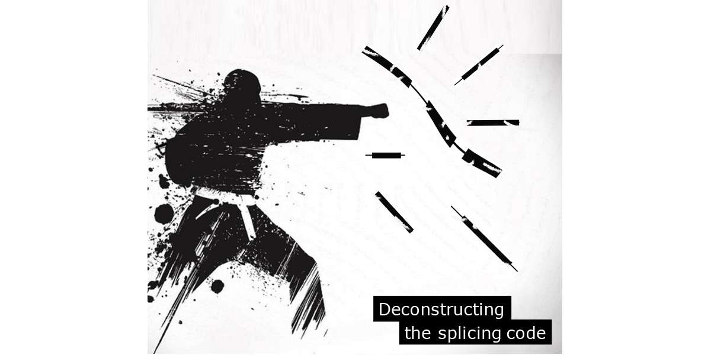

# Quantas2

*Ye Wang edited on Mar 17, 2025*

Quantas2 is a Snakemake-based workflow for quantifying splicing from raw FASTQ sequencing files, featuring dedicated sub-workflows for `RNA expression level quantification (RPKM)` and `splice site usage (SSU)` analysis,etc. This workflow builds upon [Quantas1.0.9 ](https://zhanglab.c2b2.columbia.edu/index.php/Quantas_Documentation).

**Updates in Quantas2.0.0**:

  - One command to run the whole pipeline
  - Automatic generating batch scripts, submitting and monitoring fastq files
  - Different snakemake sub-pipeline to choose
  - Simple configuration via a single file
  - Resuming from failing jobs

Pipeline Overview
-------------------
This table descriped all the sub-workflows contains in Quantas2.0.0:
| Input |Subpipeline| Description| Typical output|
| ------ | ------| ------ |------ |
| Reference genome `fasta` file;   Per-sample `fastq` files | `Quantas_SSU`|Quantification of the normalized 5' and 3' splicing site usage in each gene (value ranges from 0 to 1);  `Sample`is the name of each iput FASTQ file|  Reads aligned file:`Sample.Aligned.out.sam`    Sam file to bed file:`Sample.bed`   Coverage and statistics of mapped reads:`Sample.mapping_stats.txt`   Splice site usage of each splice site:`.splice_site_counts.txt`   Statistics of splice site usage in each gene:`sumarry.txt`  Snakemake report (optional) 
|Reference genome `fasta` file;   Per-sample `fastq` files | `Quantas_RNA_expr`|Quantification of the RNA expression level(RPKM) for each gene | RNA expression level(RPKM)matrix:`expression_matrix.txt`;   Snakemake report (optional) | 

**Software/Packages used in this process:**

  - Read mapping (single or paired end)
    - [STAR](https://github.com/alexdobin/STAR)
    - [OLego](https://zhanglab.c2b2.columbia.edu/index.php/OLego)
  - Convert sam file to bed file
    - [pysam](https://github.com/pysam-developers/pysam)

Getting Started
-------------------
See [**--&gt; the Wiki pages &lt;--**](https://github.com/yw4291/Quantas2.0/wiki) for setup and documentation.

For **questions, bug reports, and feature requests**,
[open an issue](https://github.com/yw4291/Quantas2.0/issues).
