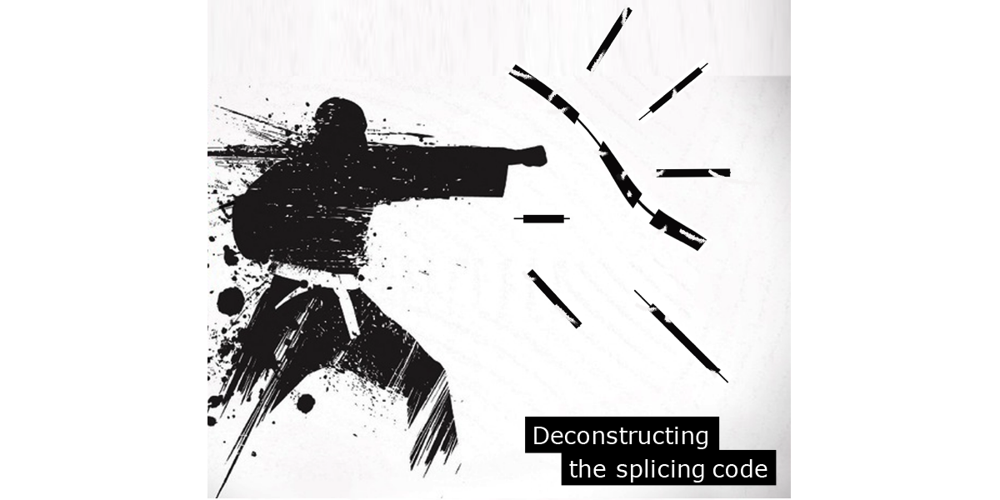

# Quantas2

*Ye Wang edited on Mar 22, 2025*

Quantas2 is a Snakemake-based workflow for quantifying splicing from raw FASTQ sequencing files, featuring dedicated sub-workflows for `RNA expression level quantification (RPKM)` and `splice site usage (SSU)` analysis,etc. This workflow builds upon [Quantas1.0.9](https://zhanglab.c2b2.columbia.edu/index.php/Quantas_Documentation)[1] in Chaolin Zhang lab.

**Updates in Quantas2.0.0**:

  - One command to run the each sub-workflow
  - Automatic generating batch scripts, submitting and monitoring fastq files
  - Different snakemake sub-workflow to choose
  - Simple configuration via a single file
  - Resuming from failing jobs

## Who uses Quantas?

### 🧬 Biologists 
* One command to deal with multiple FASTQ files
* Pipeline-oriented workflows and configure in one file to set  parameters for mapping and quantification

### ☕ Software Engineers
* Extensible sub-workflows and data
* Continuous integration and testing

### 🤖 ML Researchers 
* Dealing with data for downstream ML models, eg.[DeltaSplice](https://github.com/chaolinzhanglab/DeltaSplice) 

Workflow Overview
-------------------
This table descriped all the sub-workflows contains in Quantas2.0.0:
| Sub-workflow |Description | Input| Output|
| ------ | ------| ------ |------ |
| `Quantas_SSU` |Quantification of the normalized 5' and 3' splicing site usage in each gene (value ranges from 0 to 1);  `Sample`is the name of each iput FASTQ file |Reference genome `fasta` file;   Per-sample `fastq` files |  Reads aligned file:`Sample.Aligned.out.sam`    Sam file to bed file:`Sample.bed`   Coverage and statistics of mapped reads:`Sample.mapping_stats.txt`   Splice site usage of each splice site:`.splice_site_counts.txt`   Statistics of splice site usage in each gene:`sumarry.txt`  Snakemake report (optional) 
|`Quantas_RNA_expr`| Quantification of the RNA expression level(RPKM) for each gene  |Reference genome `fasta` file;   Per-sample `fastq` files | RNA expression level(RPKM)matrix:`expression_matrix.txt`;   Snakemake report (optional) | 

<!-- **Software/Packages used in this process:**

  - Read mapping (single or paired end)
    - [STAR](https://github.com/alexdobin/STAR)
    - Or [OLego](https://zhanglab.c2b2.columbia.edu/index.php/OLego)
  - Convert sam file to bed file
    - [pysam](https://github.com/pysam-developers/pysam) -->

Getting Started
-------------------
See [**--&gt; the Wiki pages &lt;--**](https://github.com/yw4291/Quantas2.0/wiki) for setup and documentation.

For **questions, bug reports, and feature requests**,
[open an issue](https://github.com/yw4291/Quantas2.0/issues).

## Citation

This project was developed with reference to the following articles :
~~~
[1]  Mertes, F., Matrot, B., Glaab, E., et al. (2021). *QuantAS: a comprehensive pipeline to study alternative splicing by absolute quantification of splice isoforms*. BMC Bioinformatics, 22, 580. https://doi.org/10.1186/s12859-021-04499-4
~~~
Used open-source repositories:

[ModelGenerator](https://github.com/genbio-ai/ModelGenerator) and [grenepipe](https://github.com/moiexpositoalonsolab/grenepipe/tree/master) – for project structure and documentation style.